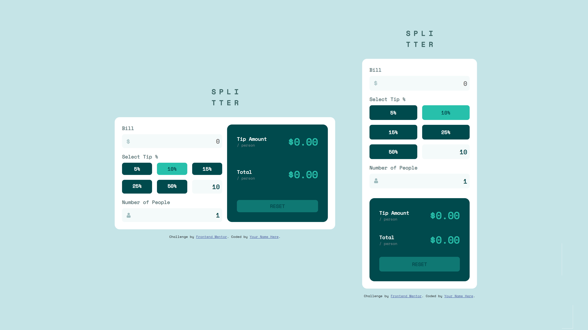

# Frontend Mentor - Tip calculator app solution

This is a solution to the [Tip calculator app challenge on Frontend Mentor](https://www.frontendmentor.io/challenges/tip-calculator-app-ugJNGbJUX). Frontend Mentor challenges help you improve your coding skills by building realistic projects.

## Table of contents

- [Overview](#overview)
  - [The challenge](#the-challenge)
  - [Screenshot](#screenshot)
  - [Links](#links)
- [My process](#my-process)
  - [Built with](#built-with)
  - [What I learned](#what-i-learned)
- [Author](#author)
- [Acknowledgments](#acknowledgments)

**Note: Delete this note and update the table of contents based on what sections you keep.**

## Overview

### The challenge

Users should be able to:

- View the optimal layout for the app depending on their device's screen size
- See hover states for all interactive elements on the page
- Calculate the correct tip and total cost of the bill per person

### Screenshot



### Links

- Solution URL: [Link](https://wjrcode.github.io/tip-calculator-app-main)

## My process

### Built with

- Semantic HTML5 markup
- CSS custom properties
- Flexbox
- CSS Grid
- [Vue](https://vuejs.org/) - JS library

### What I learned

I used to use Flexbox for everything, but sometimes it is truly more effective to use Grid, so in this project I used Grid to create the "Tip Selector".

```css
.tip-calculator__tip-selector {
  display: grid;
  grid-template-columns: repeat(3, 1fr);
  grid-gap: 1rem;
}

@media (max-width: 600px){
  .tip-calculator__tip-selector{
    grid-template-columns: repeat(2, 1fr);
  }
}
```

## Author

- Frontend Mentor - [@wjrcode](https://www.frontendmentor.io/profile/wjrcode)
